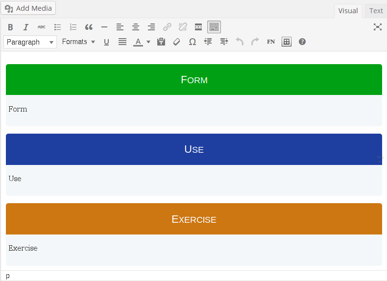
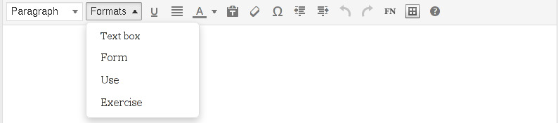

# TinyMCE Formats

## Description

### About

With TinyMCE-Formats you can split the information of one page in the 3
formats of language: form, use and content.

We want to make the language courses more user-friendly. This is the first step.

We also recommend the use of the `<!--nextpage-->` tag every time you want to
split the screen in different pages, so it is easier to read and find.

**Because the first step for teaching is organizing the ideas.**

### General Information

Our working definition of language encompasses five structural components:
phonology, semantics, syntax, morphology, and pragmatics.

* **Phonology** refers to the sounds and the intonation patterns that are
  associated with spoken language.
* **Semantics** encompasses the words of a language and the meanings associated
  with those words.
* **Syntax** describes the grammatical rules of a language—how words combine
  into phrases and sentences.
* **Morphology** refers to the rules that govern the use of morphemes. Morphemes
  are the smallest units of meaning in a language, including the prefixes and
  suffixes that mark syntactic and semantic information, such as number (i.e.,
  plurals), gender, and tense (i.e., past, present, or future).
* Finally, **pragmatics** is how we adjust our speech to our audience and use
  language toward the goal of communication.

To better address typical and atypical language development as well as
strategies of prevention and intervention, the five structural components of
language may be simplified into three essential aspects of communication:
content, form, and use (Bloom & Lahey, 1978).

* **Form** is the way in which meaning is represented, including speech, sign
  language, and writing. In the context of spoken language, form encompasses
  phonology, morphology, and syntax.
* **Use** refers to the function of language in context.
* **Content** refers to the semantics of language—the concepts and ideas that
are encoded in words.

Although each of these aspects of language can be identified separately, they
are inherently interconnected elements in communication (Bloom & Lahey).
Language problems may arise when there is a disruption within any one component
of the model or in their integration.

In order to increase the information, we add one paper to the box.

Additional information is available in the `Information` directory.

## Requirements

This plugin uses some styles from PressBooks, thus you should have installed and
activated this plugin (tested on 2.4.2).

## Installation

1. Clone (or copy) this repository to the `/wp-content/plugins/` directory
1. Activate the plugin through the 'Plugins' menu in WordPress

## Screenshots

### An example of use of boxes in the dashboard.

### The format drop-down with the custom formats.

## Changelog

### 0.3
* Renamed the plugin to *TinyMCE-Formats*.

### 0.2
* Smaller padding within boxes.
* Smaller “link to a box” anchor text.
* Removed duplicate formats.
* Added “Text box” format (from PressBooks).
* Added PressBooks in required plugins.
* Code comments for easier plugin extending.

### 0.1
* Initial version.

## Credits

Uses the [WordPress Plugin Boilerplate](http://wppb.io/).
