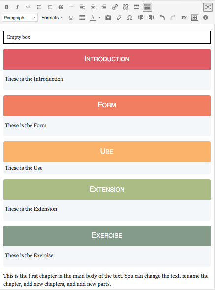
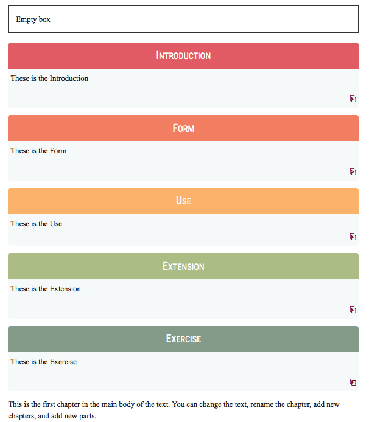

# PressBooks-TinyMCE Formats

## Description

### About

With PressBooks-TinyMCE-Formats for Wordpress you can split the information of one page in the 3
formats of language: form, use and content.
(Future development news formats for well structured page)

We want to make the language courses more user-friendly. This is the first step.

**Because the first step for teaching is organizing the ideas.**

### General Information
Read the [General Inforamtion](/README-general-information.md).

## Important information
You can not use more than one box in one page if you want to make dynamic queries.

## Requirements
This is a plugin for Wordpress (tested on 4.3)

This plugin uses some styles from PressBooks, thus you should have installed and
activated this plugin (tested on 2.4.5).

If you are using the Restriction option for the content from the box, you should have installed pippinsplugins/Restrict-Content-Pro (tested on 2.2.5)

## Installation

1. Clone (or copy) this repository to the `/wp-content/plugins/` directory
1. Activate the plugin through the 'Plugins' menu in WordPress

## Screenshots

### An example of use of boxes in the dashboard.

### The format drop-down with the custom formats.

### An example of use of boxes in the front-end.

## Changelog

### 0.6
* New: Protection for content inside of the box

### 0.5
* New: Examples box
* New: Activities box
* New: Task box

### 0.4
* New: Introduction box
* New: of Extension box
* tweak: Change the bottom for link copy & to &#x2398
* tweak: Renamed the plugin to *PressBooks-TinyMCE-Formats*
* Fix: file name of the plugin in tinymce-formats.php to: Pressbooks TinyMCE-Formats

### 0.3
* Renamed the plugin to *TinyMCE-Formats*.

### 0.2
* Smaller padding within boxes.
* Smaller “link to a box” anchor text.
* Removed duplicate formats.
* Added “Text box” format (from PressBooks).
* Added PressBooks in required plugins.
* Code comments for easier plugin extending.

### 0.1
* Initial version.

## Credits

Uses the [WordPress Plugin Boilerplate](http://wppb.io/).

Color palette by somurmujo http://adobe.ly/1pJTUkD
